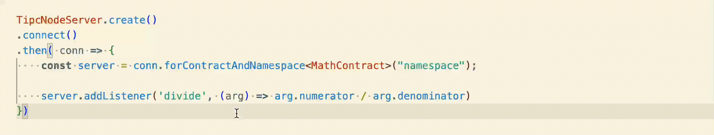

# TIPC - Typed Inter-Process Communication

TIPC is a [Typescript](https://www.typescriptlang.org/) library for easily communicating between different processes in a type-safe manor, using Websockets. In a Node process, it uses the [ws](https://www.npmjs.com/package/ws) library, and in the browser it uses built-in websockets. TIPC only relies on compile-time type checking.

Normally, writing code that communicates using a websocket can be tricky, since you can only send and receive strings. You will have to manually encode/decode JSON objects, check that you send and receive correct data, and somehow keep track on what functions should consume the data.

TIPC lets you write a contract type, declaring topics and what types should be send/received on these topics. This removes a lot of the overhead for developers, and makes websocket communication similar to using a regular pub/sub architecture.

# Installation
## Node (server and/or client)
`npm install tipc ws`
## Browser (client)
`npm install tipc`

# Usage
TIPC leverages [mapped types](https://www.typescriptlang.org/docs/handbook/2/mapped-types.html) to specify type-safe contracts between the server and the client.

```ts
type MathContract = {
    double: number,
    add: [number, number],
    divide: {numerator: number, denominator: number},
}
```
TIPC will then ensure that you can only send the corresponding types to that the topic:


Likewise, if you are listening to messages on a topic, the callback function's arguments will automatically be typed from the contract:


**It is paramount that all TIPC users share type definitions.** If different users adhere to different contracts, they will likely run into compatibility problems. For TIPC to work best, consider using a [monorepo](https://en.wikipedia.org/wiki/Monorepo), use [npm workspaces](https://docs.npmjs.com/cli/v7/using-npm/workspaces) or sharing the type definitions through [git submodules](https://git-scm.com/book/en/v2/Git-Tools-Submodules).

## Namespaces
Each TIPC instance (server or client) needs to be given to a namespace. Since several TIPC instances can use the same underlying websocket connection, it is possible that two contract types declares the same topic. Namespaces are a way to increase cardinality, and reduce accidental topic collisions. Ideally, namespaces should be chosen so the risk for accidental namespace collision is minimal. 

Each time you call `forContractAndNamespace<Contract>(namespace)`, a new namespaced instance is generated for the given namespace and contract. If you wish for several parts of a code base to use the same namespaced instance, it is recommended you wrap access to TIPC in a singleton.

## request-reply
The above section shows how to use fire-and-forget type requests. TIPC also supports request-reply type requests, for cases when a client wants to send something for processing to the server, and then get a reply. Normally when using a websocket, this can be a tricky ordeal, but TIPC handles it internally and exposes a straight-forward API.

In your contract type, creating a topic that maps to a function:

```ts
type MathContract = {
    subtract: (minuend: number, subtrahend: number) => number,
}
```

Then use the `invoke` method on the client to send the request, and get a `Promise<number>` back. The server can answer to requests that wants a response using `setHandler` instead of `setListener`. 

**A topic can only have one handler**, so trying to add a handler to a topic that already has a handler will throw an exception.

## Same-side listeners
It is common to want to listen to messages on the same instance that sends the message. For example, if you send an update to a article, clients subscribing to the `update` topic on the `articles` namespace will update the article. But the server might also want to react to updates to articles. Normally, you'd set up a separate event emitter on the server, and then first call TIPC to send events to all clients, and then send the same event on the server's event emitter. But the event emitter in Node isn't type safe.

When sending a fire-and-forget request with TIPC, listeners _on the same instance_ will also receive this message. The messages origins are opaque. So you can use TIPC to listen to type-safe events that are fired on the same instance.

## single-use listeners (and handlers)
Sometimes, you want to add a one-time use listener on a topic. For those cases, use the `setOnceListener` and/or `setOnceHandler`. These will be removed once they've been called once. Remember that a topic can only have one handler, but multiple listeners. 

# License
TIPC is licensed under the Apache License 2.0. Please see the [License file](./LICENSE)